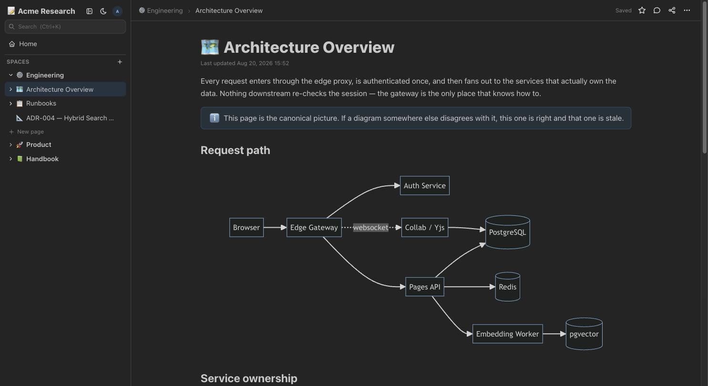
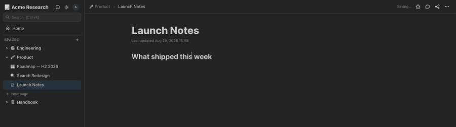
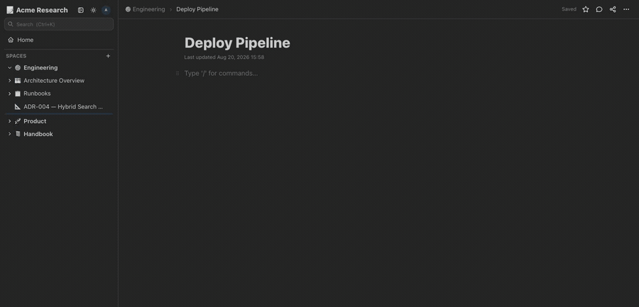
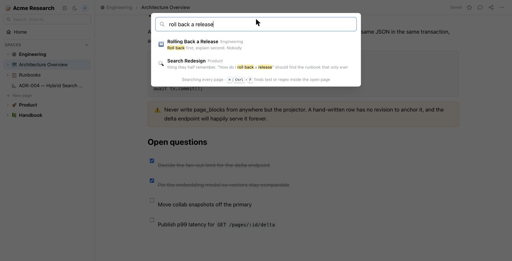
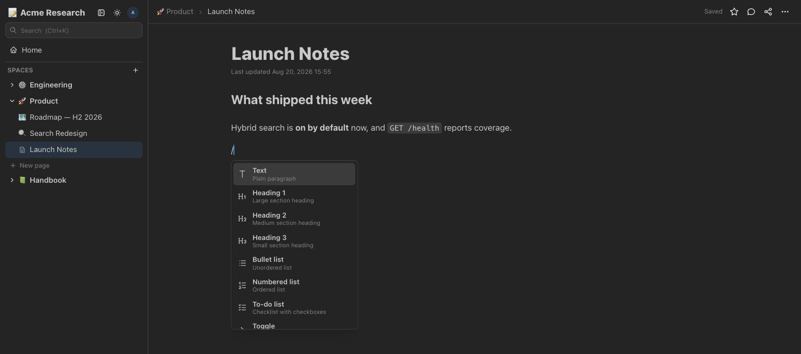
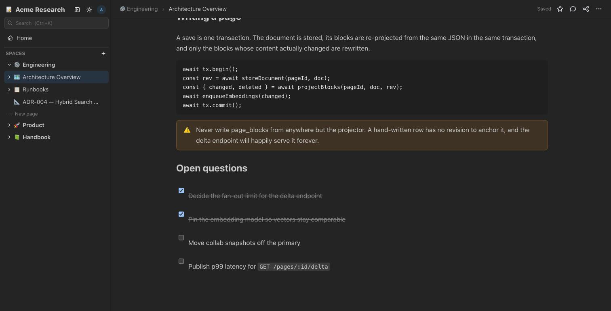
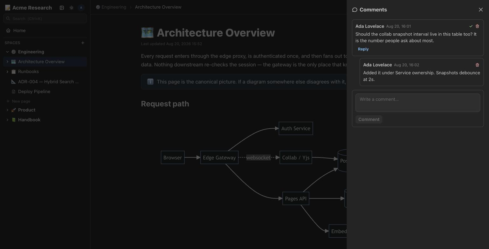
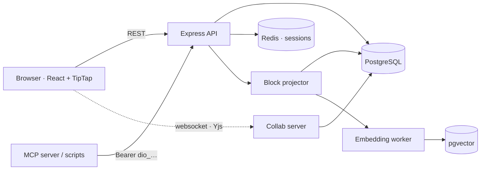

<div align="center">



<br>

**A self-hosted wiki & note-taking app in the spirit of Docmost and Notion — built from scratch.**

React · Mantine · TipTap on the front. Express · PostgreSQL · Redis on the back.
Shipped as one versioned Docker image.

<br>

[](https://github.com/gagewillette/Diomedes/actions/workflows/ci.yml) [](https://github.com/gagewillette/Diomedes/actions/workflows/docker-publish.yml)  

    

<br>

[**Quick start**](#-quick-start) · [Features](#-what-it-does) · [See it work](#-see-it-work) · [Architecture](#-under-the-hood) · [Semantic search](#-semantic-search-optional) · [API](docs/API.md)

</div>

<br>

<div align="center">
<picture>
  <source media="(prefers-color-scheme: dark)"  srcset="docs/assets/hero-dark.jpg">
  <source media="(prefers-color-scheme: light)" srcset="docs/assets/hero-light.jpg">
  
</picture>
<sub><i>Light and dark. The screenshot above follows your GitHub theme — so does the app.</i></sub>
</div>

---

## ✨ What it does

<table>
<tr>
<td width="50%" valign="top">

### ✍️ An editor that gets out of the way

Paste markdown and it formats itself. Type markdown and it formats as you go.
Slash commands, drag-handle block reordering, a Word-style smooth caret,
tables, task lists, syntax-highlighted code, KaTeX math, callouts, toggles,
footnotes, and YouTube/iframe embeds.

</td>
<td width="50%" valign="top">

### 📐 Three diagram editors, inline

**Mermaid**, **Excalidraw** and **Draw.io** — each rendered in the page and
editable in place. Diagrams travel over the API as plain text — a `mermaid`
fence, or a `drawio` fence of mxGraph XML — and draw exactly as if they'd been
made by hand.

</td>
</tr>
<tr>
<td width="50%" valign="top">

### 👥 Real-time collaboration

Several people edit one page at once over a Yjs CRDT on a websocket. You see a
colleague's **text caret** while they type and their **mouse pointer**,
Miro-style, while they read — coloured from their user id, so the same person is
the same colour for everyone.

→ [docs/realtime-collaboration.md](docs/realtime-collaboration.md)

</td>
<td width="50%" valign="top">

### 🧱 Block storage

Every block carries a stable id, and a projection of those blocks is derived
inside the same transaction that stores the page. Change one paragraph and one
chunk is re-embedded, not the whole page.

→ [docs/block-storage.md](docs/block-storage.md)

</td>
</tr>
<tr>
<td width="50%" valign="top">

### 🗂 Organisation that scales

Spaces with nested page trees, full-text search (optionally **semantic**),
favorites, page history with restore, threaded comments, trash, public share
links, Markdown import/export, dark mode.

</td>
<td width="50%" valign="top">

### 🔐 Access control

Username/password auth (bcrypt + Redis sessions), workspace roles
(owner/admin/member), per-space roles (full access / can edit / can view),
admin user management, and per-user editor preferences.

</td>
</tr>
<tr>
<td width="50%" valign="top">

### 📎 Documents, not just notes

Drop a **PDF** or **PowerPoint** into a page and it lands where you dropped it.
PPTX can be converted to PDF on upload (LibreOffice, bundled in the image) or
kept as-is.

</td>
<td width="50%" valign="top">

### 🤖 An API built for robots

Every endpoint takes a session cookie *or* a personal API token
(`Authorization: Bearer dio_…`) — built to hang an MCP server off of.

→ [docs/API.md](docs/API.md) · [FEATURES.md](FEATURES.md)

</td>
</tr>
</table>

---

## 🎬 See it work

<div align="center">

**Markdown shortcuts and slash commands**



<sub><code>##</code> becomes a heading, <code>**bold**</code> becomes bold, <code>`code`</code> becomes code — then <code>/</code> opens the command menu.</sub>

<br><br>

**Diagrams, rendered in the page**



<sub>Insert from the slash menu, edit the source in place, and the picture redraws as you save.</sub>

</div>

<table>
<tr>
<td width="50%" valign="top" align="center">

<br><sub><b>⌘K</b> — search every page, with hits highlighted in context</sub>
</td>
<td width="50%" valign="top" align="center">

<br><sub><b>/</b> — every block type, one keystroke away</sub>
</td>
</tr>
<tr>
<td width="50%" valign="top" align="center">

<br><sub>Code, callouts and task lists</sub>
</td>
<td width="50%" valign="top" align="center">

<br><sub>Threaded comments, resolvable</sub>
</td>
</tr>
</table>

---

## 🚀 Quick start

```bash
cp docker-compose.example.yml docker-compose.yml   # adjust volumes to taste
cp .env.example .env                               # fill in APP_SECRET + POSTGRES_PASSWORD
docker compose up -d
```

The image is pulled from `ghcr.io/gagewillette/diomedes` — **no local build needed**.

Diomedes listens on **port 3000**. The first visit shows a one-time setup screen
that creates the owner account and workspace.

> [!NOTE]
> Your real `docker-compose.yml` is gitignored — it holds host-specific mount
> paths and belongs on the server, not in this repo.

The example file uses named volumes; switch them to bind mounts if you want the
data at fixed paths (this is what the author's server does):

| Path | Purpose |
|---|---|
| `/mnt/storage/diomedes/db` | PostgreSQL data |
| `/mnt/storage/diomedes/redis` | Redis persistence (sessions survive restarts) |
| `/mnt/storage/diomedes/app-data` | Uploaded files/attachments (documents under `users/<user-id>/`) |

<details>
<summary><b>Running it locally for development</b></summary>

<br>

```bash
npm run dev        # starts Postgres + Redis in Docker, then the server and Vite
npm run dev:down   # tears the containers back down
```

`scripts/dev.sh` bind-mounts the databases under `./data`, so state survives a
restart. Setting `SEMANTIC_SEARCH_ENABLED=true` in `.env` is the whole switch for
hybrid search locally — it starts the same containerised Ollama and blocks on the
first model download.

</details>

---

## 🏗 Under the hood



A save is **one transaction**: the document is stored, its blocks are re-projected
from the same JSON in the same transaction, and only the blocks whose content
actually changed are rewritten, re-embedded, and reported by
`GET /api/pages/:id/delta?since=N`.

### Repository layout

```
diomedes/
├── client/            # React SPA (Vite, Mantine UI, TipTap editor)
├── server/            # Express API (ESM, no build step)
├── docs/              # API, block storage, realtime collaboration, assets
├── scripts/           # bump-version.sh (versioning), release.sh (manual release)
├── Dockerfile         # multi-stage: build client → install server deps → runtime
└── docker-compose.example.yml  # diomedes + postgres + redis + watchtower
```

---

## 📎 Documents (PDF / PowerPoint)

Type `/document`, or drag a file into the page and it lands where you dropped it.
Either way you get a bar on its own line: the filename on the left, download and
view buttons on the right.

- **PDF** — stored as uploaded. *View* opens it in a new tab, where Chrome's
  built-in PDF viewer renders it. There is no in-app viewer to go wrong.
- **PPTX** — you choose on upload whether to keep the original PowerPoint or
  convert it to PDF. Converting happens on the server at upload time, and only
  the PDF is stored. A stored PPTX can be downloaded but never viewed in the
  browser, so its *View* button is disabled.

Documents are stored under `<storage>/users/<user-id>/`, separate from the
per-space layout used by inline images and video. Access is still checked
against the owning page's space, or its public share link.

Conversion shells out to LibreOffice, which the app image installs. Running the
server directly on a host without LibreOffice is fine — the editor detects it,
disables the PDF option, and keeps the PPTX as-is. See `SOFFICE_PATH` in
`.env.example`.

---

## 🔎 Semantic search (optional)

Search is Postgres full-text by default: fast, free, and exactly as it has always
worked. Turning semantic search on adds vector similarity alongside it, so
*"how do I roll back a release"* finds the runbook that only ever says
*"revert to the previous tag"*.

Embeddings come from a local model by default — **no API key, no data leaving the
host, and nothing to install**. `docker-compose.example.yml` ships an `ollama`
service that downloads its own model on first boot; you turn it on with its
compose profile:

```bash
# .env — the defaults in .env.example already match this
SEMANTIC_SEARCH_ENABLED=true
COMPOSE_PROFILES=ollama
EMBEDDING_API_URL=http://ollama:11434/v1/embeddings
EMBEDDING_MODEL=nomic-embed-text
EMBEDDING_DIMENSIONS=768
```

`docker compose up -d` then pulls the model (~274 MB) into the `ollama-models`
volume on the first start. The container stays unhealthy until that finishes and
the app waits on it, so no page is ever embedded against a half-downloaded
model. Later starts find the model in the volume and come up in seconds, offline
included.

> [!WARNING]
> The model is deliberately **not** auto-updated — swapping it invalidates every
> stored vector. Upgrade by hand when you mean to:
> ```bash
> docker compose exec ollama ollama pull nomic-embed-text
> ```

<details>
<summary><b>Tuning, alternative providers, and the health endpoint</b></summary>

<br>

CPU is enough (~50ms per chunk); there is a commented GPU block in the compose
file for NVIDIA hosts. To use OpenAI instead, clear `COMPOSE_PROFILES` and the
three `EMBEDDING_*` values and set `OPENAI_API_KEY=sk-...` — any other
OpenAI-compatible embedding server works the same way via `EMBEDDING_API_URL`.

`EMBEDDING_DIMENSIONS` must match the model's native width. Changing it means
rebuilding `page_chunks` (`DROP TABLE page_chunks`, restart, then backfill).

It needs the `pgvector/pgvector:pg16` db image (already the default in
`docker-compose.example.yml` — a drop-in replacement that reuses an existing
`postgres:16` volume). After switching it on, embed the pages you already have:

```bash
docker compose exec diomedes npm run backfill:embeddings --prefix server
```

From then on pages are chunked and embedded by a background worker whenever they
are saved, so writes stay fast. Results fuse full-text ranking and vector
similarity by reciprocal rank fusion. If the embedding API is slow or down,
search silently falls back to full-text rather than failing.

`GET /api/health` reports the active mode, how much of the corpus is embedded,
the queue backlog, and the running embedding spend:

```json
{"ok":true,"search":{"mode":"hybrid","coverage":{"total":412,"ready":412,"chunks":1830},
 "queueDepth":0,"embeddings":{"tokens":184320,"estimatedUsd":0.0037}}}
```

Leaving `SEMANTIC_SEARCH_ENABLED=false` costs nothing: no embedding calls, no
background work, no vector tables touched, and with `COMPOSE_PROFILES` empty the
ollama container is never created.

In local dev, `SEMANTIC_SEARCH_ENABLED=true` in `.env` is the whole switch:
`npm run dev` starts the same ollama container, points the server at it on
`localhost:11434`, and blocks on the first model download. Stop any Ollama you
installed on the host first — it holds the same port and the container replaces
it.

</details>

---

## 📦 Versioning & releases

Versions bump themselves. Pushing to `main` runs
`.github/workflows/docker-publish.yml`, which works out the bump, commits it,
tags the commit, and publishes the image. **There is nothing to do by hand.**

Three versions are tracked, and the two component versions are meant to drift
apart:

| File | Meaning | Bumps when |
| --- | --- | --- |
| `package.json` | the **release** — what the image is tagged with | anything in `server/`, `client/`, or the `Dockerfile` changes |
| `server/package.json` | the server component | `server/` changes |
| `client/package.json` | the client component | `client/` changes |

A client-only change moves the client and leaves the server where it is, so the
two diverge over time — that is the point. The release version is the one that
has to stay coherent, because the server and the built client ship inside a
single image.

**Bump size** comes from the commit messages since the last `v*` tag. The
default is a patch. Say `[minor]` or use a `feat:` subject for a minor;
`[major]`, `BREAKING CHANGE`, or a `feat!:` subject for a major. The largest
bump in the range wins.

```bash
./scripts/bump-version.sh              # dry run — what would the next push do?
./scripts/bump-version.sh --apply      # apply it locally (CI does this for you)
```

Each release pushes a `v<release>` tag, plus `server-v<x.y.z>` / `client-v<x.y.z>`
tags for whichever component actually moved. Published image tags: `:latest`
(default branch), `:1.2.0`, `:1.2`, `:sha-abc1234`.

`./scripts/release.sh` still exists as an escape hatch for cutting a release by
hand — re-releasing an old commit, or forcing a specific version.

> [!IMPORTANT]
> The bump commit is pushed to `main` by `GITHUB_TOKEN`. If you ever put branch
> protection on `main`, give the Actions bot a bypass or the push will be
> rejected. That token deliberately cannot trigger workflows, which is why the
> bump and the build live in one workflow rather than two — and why this cannot
> loop.

---

## 🚢 Auto-deployment

`docker-compose.example.yml` includes a **watchtower** container that polls GHCR
every minute and restarts the app when the tag it runs points at a new image.
`--label-enable` means it only touches containers carrying

```yaml
labels:
  com.centurylinklabs.watchtower.enable: "true"
```

so Postgres and Redis — pinned to exact patch versions — are never auto-updated,
along with any unrelated stacks sharing the host. Schema changes are applied by
the app's own idempotent `migrate()` on boot, so an unattended restart is safe.

To pin the deployment instead, set `DIOMEDES_VERSION=1.1.0` in `.env`; watchtower
only ever moves a container to a newer image *under the same tag*, so an explicit
version effectively disables auto-updates. Rolling back is
`DIOMEDES_VERSION=<old> docker compose up -d`.

If you make the GHCR package private, run `docker login ghcr.io` on the host with
a PAT that has `read:packages`, and uncomment the `config.json` mount on the
watchtower service.

<details>
<summary><b>Recovering a lost Postgres password</b></summary>

<br>

Postgres only applies `POSTGRES_PASSWORD` when it initializes an empty data
directory — on an existing volume the original password still governs. If it's
lost, reset it against the existing data:

```bash
docker compose stop diomedes
docker compose exec db psql -U postgres -c "ALTER USER diomedes PASSWORD 'new-password';"
# put the same value in .env, then:
docker compose up -d
```

</details>

<details>
<summary><b>HTTPS via a Cloudflare tunnel</b></summary>

<br>

TLS terminates at Cloudflare's edge; the tunnel forwards to plain HTTP locally, so no
certificates live on the server. In **Zero Trust → Networks → Tunnels**, point a
public hostname (e.g. `docs.gageserver.net`) at `HTTP → localhost:3000`, and keep
`APP_URL` in `.env` matching that hostname.

</details>

---

## 🛠 Ops cheatsheet

```bash
docker compose logs -f diomedes                        # app logs
docker compose logs -f watchtower                      # what auto-deploy is doing
docker compose pull && docker compose up -d            # deploy now, don't wait for the poll
./scripts/release.sh                                   # tag a release; Actions builds it
docker exec -it diomedes-db psql -U diomedes diomedes  # db shell
docker exec diomedes-db pg_dump -U diomedes diomedes > backup.sql
```

---

<div align="center">
<sub>

**[API reference](docs/API.md)** · **[Block storage](docs/block-storage.md)** · **[Realtime collaboration](docs/realtime-collaboration.md)** · **[Feature map vs. Docmost](FEATURES.md)**

</sub>
</div>
